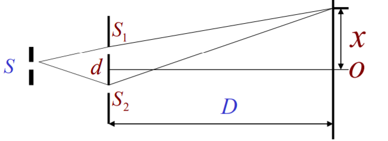
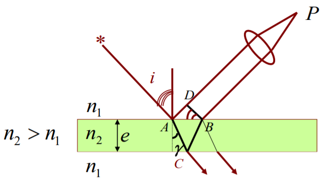

[TOC]

# 前言

此攻略由一直吃老本的Sora提供。由于他or她(?)一直吃老本，所以有些观念可能跟老师不一致，尽量以老师为准，此攻略也尽量贴合课本。

考虑到有女娲补天选手，本攻略在老师给的提纲基础上尽量详尽并尽量保持思维的畅通。

一些符号约定：  
> 1. 粗体表示向量。
> 2. 流数符号表示对时间的导数，如$\dot{x}$为$x$对时间的一阶导数，$\ddot{x}$为$x$对时间的二阶导数。

非女娲补天选手可以直接看[某些做题的心得技巧](#某些做题的心得技巧)。

想要复习习题而又嫌答案有错的可以浏览我的仓库  
[SoraShu/Phisics-Homework](https://github.com/SoraShu/Phisics-Homework)  
[备用的gitee仓库](https://gitee.com/SoraShu/Phisics-Homework) 若校园网抽风请用这个
# 力学
> 基础，且与高中重复率高，只是有些概念需要更新。会尽量涉及所有定义。

## 质点运动学
**参考系**：通俗讲，参考系=尺子+表。描述质点运动前需要确定参考系。

**质点运动的描述**：位矢是时间的函数  
$$
\boldsymbol{r}=\boldsymbol{r}(t)
$$
定义位移为位矢的变化量。  
定义速度为位矢对时间的一阶导数
$$
\boldsymbol{v=\dot{r}}
$$
定义加速度为速度对时间的二阶导数
$$
\boldsymbol{a=\dot{v}}
$$
根据坐标系不同，这些量可以投影到各个方向。  
这三个量的微分关系很重要，下面列出一个常用的变换。设运动仅沿x方向，或投影到x方向。
$$
a=\frac{dv}{dt}=\frac{dv}{dx}\frac{dx}{dt}=v\frac{dv}{dx}
$$

**圆周运动**：  
圆周运动可由角度唯一确定，于是赋予角坐标特性。  
圆周运动的描述可写为：
$$
\begin{cases}
    r=r_0\\\theta=\theta(t)
\end{cases}
$$
我们约定角速度方向满足右手定则，赋予角速度矢量的性质。记作$\boldsymbol{\omega}$。  
规定角速度对时间的一阶导数为角加速度，$\boldsymbol{\beta=\dot{\omega}}$。
角量与线量的关系为：
$$
\boldsymbol{v=\omega\times r}
$$
给出一般圆周运动加速度表达式：
$$
\boldsymbol{a}=\boldsymbol{\omega\times(\omega\times r)+\beta\times r}
$$
当位矢与转轴垂直，可化为：
$$
\begin{cases}
    a_n&=-\omega^2r\\
    a_t&=\beta r
\end{cases}
$$

**相对运动**：  
实质上是坐标系的转换。设$S$相对$S^\prime$的位矢为$\boldsymbol{R}$，质点在$S$与$S^\prime$的位矢分别为$\boldsymbol{r}$与$\boldsymbol{r^\prime}$。于是有：
$$
\boldsymbol{r=r^\prime+R}
$$
对时间求导有：
$$
\boldsymbol{v=v^\prime+u}
$$
$$
\boldsymbol{a=a^\prime+a_s}
$$

## 质点动力学
~~牛顿三定律~~**牛顿第二定律**(又名牛顿方程)：
$$
\boldsymbol{F}=m\boldsymbol{a}
$$

**万有引力定律**：
$$
\boldsymbol{F_G}=-G\frac{m_1m_2}{r^2}\boldsymbol{e_r}
$$

**动能定理**：  
首先定义功，外力$\boldsymbol{F}$在极小段时间所做的元功为：
$$
dA=\boldsymbol{F}\cdot d\boldsymbol{r}
$$
总功即为力的路径积分：
$$
A=\int_l\boldsymbol{F}\cdot d\boldsymbol{r}
$$
顺手定义功率：
$$
P=\frac{dA}{dt}=\boldsymbol{F\cdot v}
$$
定义动能：
$$
E_k=\frac{1}{2}mv^2
$$
动能定理表达式为：
$$
A_合=\Delta E_k
$$

**功能原理与机械能守恒定律**：  
首先引入保守力概念：做功与路径无关的力称为保守力，运用粗浅的高数知识，即旋度为0的力称为保守力，即满足$\boldsymbol{\nabla\times F=0}$。  
运用此特性我们定义势能。人为规定势能0点O，定义P点的势能：
$$
E_p=-A_{OP}=-\int_l\boldsymbol{F}\cdot d\boldsymbol{r}
$$
列出常见势能：
$$
\begin{cases}
    E_p&=-G\frac{m_1m_2}{r}\\
    E_p&=mgh\\
    E_p&=\frac{1}{2}kx^2
\end{cases}
$$
定义机械能：系统某时刻的动能与势能之和。  
功能原理：
$$
A_外+A_{非保内}=\Delta E\tag{E为机械能}
$$
机械能守恒定律：  
若$A_外+A_{非保内}=0$，则机械能守恒。一般有如下两种表示方法。
$$
\begin{aligned}
    &E=Const\\
    &\frac{dE}{dt}=0
\end{aligned}
$$
下面一种经常用于代替牛顿方程列式。后面会讲。

**动量定理**：  
定义动量$\boldsymbol{p}=m\boldsymbol{v}$   
定义冲量$\boldsymbol{I}=\int_{t_0}^{t_1}\boldsymbol{F}dt$  
动量定理：
$$
\boldsymbol{I}=\Delta\boldsymbol{p}
$$

**动量守恒定律**：  
若系统不受外力或所受外力矢量和为0，则系统动量守恒。
$$
\sum m_i\boldsymbol{v}_i=Constvector
$$

## 刚体
> 仅讨论刚体的定轴转动。

类似圆周运动，刚体的定轴转动也可由角唯一确定，继承质点圆周运动使用的所有角量。

**转动定律**：  
定义力矩$\boldsymbol{M=r\times F}$  
定义刚体关于定轴的转动惯量
$$
J=\iiint_V r^2dm=\iiint_V r^2\rho dV
$$
转动定律：
$$
\boldsymbol{M}_合=J\boldsymbol{\beta}
$$

**关于转动惯量**：  
不加证明给出三个定理  
平行轴定理：过质心转轴和与之平行的转轴距离为d的转动惯量存在如下关系：
$$
J_o=J_c+md^2
$$
垂直轴定理：对于薄片，若正交三轴有两个轴a,b在薄片所在面，另一轴为z，有：
$$
J_z=J_a+J_b
$$
不知道叫什么：对正交三轴x,y,z以及其交点O，<u>此处r为到O的距离</u>，有：
$$
J_x+J_y+J_z=2\iiint_Vr^2dm
$$
不加证明给出几种常见体的转动惯量(括号注明求解最佳路径)  
均匀细杆，转轴垂直杆且通过质心：$J=\frac{1}{12}ml^2$  
均匀细杆，转轴垂直杆且通过杆一段：$J=\frac{1}{3}ml^2$(平行轴定理)  
均匀薄圆环or圆柱面，转轴垂直圆面且通过圆心：$J=mR^2$  
均匀圆盘or圆柱体，转轴垂直圆面且通过圆心；$J=\frac{1}{2}mR^2$  
均匀球壳，转轴过球心：$J=\frac{2}{3}mR^2$(不知道叫什么定理)  
均匀球体，转轴过球心：$J=\frac{2}{5}mR^2$(不知道叫什么定理)  

**类比质点**：
$$
\begin{aligned}
    E_k&=\frac{1}{2}J\omega^2\\
    A&=\int_{\theta_0}^{\theta_1}Md\theta
\end{aligned}
$$

**角动量定理**：
定义质点角动量，对参考点O有：
$$
\boldsymbol{L}=\boldsymbol{r\times p}=\boldsymbol{r}\times m\boldsymbol{v}
$$
对于质点系：
$$
\boldsymbol{L}=\sum \boldsymbol{L}_i
$$
对于刚体，相对转轴有(其实是相对于转轴上所有点都一样)：
$$
\boldsymbol{L}=J\boldsymbol{\omega}
$$
角动量定理：
$$
\int_{t_0}^{t_1}\boldsymbol{M}dt=\Delta\boldsymbol{L}
$$

**角动量守恒**：  
刚体所受合外力矩为0，则有：
$$
\boldsymbol{L}=Constvector
$$

# 电磁学  
> ~~那些高数下没学好的人有难了，我存在，就是要给他们带去噩梦~~

## 静电场

**库仑定律**：  
点电荷：
$$
\boldsymbol{F}=\frac{1}{4\pi\epsilon_0}\frac{q_1q_2}{r^2}\boldsymbol{e}_r
$$
带电体：
$$
\boldsymbol{F}=\iiint_V\frac{1}{4\pi\epsilon_0}\frac{q\rho}{r^3}\boldsymbol{r}dV
$$
电介质影响：  
替换$\epsilon_0\to\epsilon$，$\epsilon=\epsilon_r\epsilon_0$

**电场**：  
场的概念：数学上，运用粗浅的高数知识，标量场(数量场)与矢量场(向量场)可以这样定义：对于空间区域$G$内的任意点$M$，都有一个确定的标量or矢量，称空间区域$G$内确定了一个标量场or矢量场。
定义电场：单位电荷受到的电场力。  
点电荷产生的电场：
$$
\boldsymbol{E}=\frac{1}{4\pi\epsilon_0}\frac{q}{r^2}\boldsymbol{e}_r
$$
电场强度满足叠加定理，空间电场强度等于各带电体单独作用产生电场的叠加。  
故对于带电体有：
$$
\boldsymbol{E}=\iiint_V\frac{1}{4\pi\epsilon_0}\frac{\rho}{r^3}\boldsymbol{r}dV
$$

**高斯定理**：  
我一般记这个，将真空中和介质中的高斯公式统一起来：
$$
\oiint_S\epsilon_0\boldsymbol{E}\cdot d\boldsymbol{S}=\sum q_i
$$
亦可以写为体积分形式：
$$
\oiint_S\epsilon_0\boldsymbol{E}\cdot d\boldsymbol{S}=\iiint_V\rho dV
$$
运用条件及方法：
1. 高度对称。
2. 高斯面一般让电场线垂直穿过或和电场线平行。

**电势**：  
可证静电力为保守力，静电场为保守场。事实上静电场为有源无旋场。  
> 这个要说定义感觉有点懵了，课本上给的是单位电荷的静电能。算了，直接进计算。

点电荷的电势：
$$
U_p=\frac{q}{4\pi\epsilon_0r}
$$
电势满足简单叠加。带电体直接积分。
想知道某点电势也可以用：
$$
U_p=\int_a^\infty\boldsymbol{E}\cdot d\boldsymbol{r}
$$
或者运用粗浅的高数知识，电势其实是电场的势函数。 

若已知电势求电场可用$\boldsymbol{E}=-\nabla U$。

**导体的静电平衡**：
在静电平衡时，导体内部无电场。  
运用高斯定理可求得导体表面电荷分布：$\sigma=\epsilon_0E_n$

**电容器**：
定义式：
$$
C=\frac{q}{U_1-U_2}
$$

**电介质**：  
> 据我所知进入电介质很多人会开始迷惑。电介质也是静电场中最玄学的部分。

注意事项：  
1. 注意区别自由电荷、总电荷、极化电荷，求他们分别需要列不同的高斯定理。
2. 使用高斯定理求自由电荷的时候需要注意介电常数是否发生变化。
3. 一旦涉及到求总电荷，要注意约化用的电位移不能再搬到式子上。

高斯定理及对比：
$$
\oiint_S\epsilon_0\boldsymbol{E}\cdot d\boldsymbol{S}=\sum q_0\tag{总电荷}
$$
$$
\oiint_S \boldsymbol{D}\cdot d\boldsymbol{S}=\sum q\tag{自由电荷}
$$
$\boldsymbol{D}$为电位移矢量，$\boldsymbol{D}=\epsilon\boldsymbol{E}$

**静电能**：
> 这个之前有人问过我来着，好像是问静电能和电势能的关系，这个有点复杂，如果真的涉及到静电能推荐用能量密度做。

能量密度：(是标量但不满足简单线性叠加)
$$
w_e=\frac{1}{2}\boldsymbol{D\cdot E}
$$
静电能：
$$
W_e=\iiint_Vw_edV
$$

## 电流场
> 把这个东西放静磁场好像有点不好，单列吧

**电流**：  
电流强度：$I=\frac{dq}{dt}$，单位时间通过截面的电荷量。  
电流密度：$j=\frac{dI}{dS_\perp}$，单位时间通过单位面积的电荷量，并且规定方向与正电荷运动方向相同，故电流密度$\boldsymbol{j}$是矢量。  
电流面密度：$\sigma=\frac{dI}{dl_\perp}$
> 为方便区别这三个量且不至于混淆，我们可以称电流强度为电流线密度，电流密度为电流体密度，将三个量统一起来。

**传导电流与电场的关系**：
$$
\boldsymbol{j}=\sigma\boldsymbol{E}
$$
其中$\sigma$为导体的电导率，注意与电流面密度区别开。

**电动势**：
定义为电源中非静电力对单位电荷做的功，$\mathscr{E}=\frac{A}{q_0}$。  
辨析：
- 电动势就是电压($\times$)`电压在定义上与静电场静电力相关联，与电动势无关`
- 电动势是力($\times$)`这个量纲都不一样，我觉得会混淆的都是大佬，开局学的英语教材，这玩意英文是Electromotive Force`
- 电动势是非静电场($\times$)`同样的量纲就不对，只能说是一个非静电场在空间上的作用效果`

## 磁场

引入磁感应强度$\boldsymbol{B}$来描述磁场。
> 磁场强度为$\boldsymbol{H}$，二者的关系为$\boldsymbol{B}=\mu_0\boldsymbol{H}$

**洛伦兹力**：
$$
\boldsymbol{F}=q\boldsymbol{v\times B}
$$

**磁场的高斯定理**：
$$
\oiint_S\boldsymbol{B}\cdot d\boldsymbol{S}=0
$$
亦即磁感应强度的散度为0，说明磁场的无源性。

**毕奥-萨伐尔定律**：  
对于一电流元有：
$$
d\boldsymbol{B}=\frac{\mu_0}{4\pi}\frac{Id\boldsymbol{l\times e_r}}{r^2}
$$
> 由于我们找不到电流元这种东西，所以单独分析两个电流元的相互作用力是不行的，因此结果不符合牛顿三定律也没什么奇怪的。

实际计算时我们总是要求回路产生的磁场，
$$
\boldsymbol{B}=\oint_l\frac{\mu_0}{4\pi}\frac{Id\boldsymbol{l\times e_r}}{r^2}
$$
> 课本上没有写闭合回路积分符号，个人觉得不好，因为电流总是要有回路才行。当你对两段电流而不是两个回路分析的时候，算相互作用力也会得到违反牛三的结果。

**安培环路定理**：  
$$
\oint_l\boldsymbol{B}\cdot d\boldsymbol{l}=\mu_0I=\mu_0\iint_S\boldsymbol{j}\cdot d\boldsymbol{S}
$$
亦即磁感应强度的旋度为$\mu_0\boldsymbol{j}$，说明磁场的有旋性。磁场非保守场，无法像静电场那样定义标量的磁势。`说明可以定义矢量的势（doge）`  
用安培环路定理求磁场所需要的的条件比高斯定理高很多，绝大多数时候还是使用毕奥-萨伐尔定律求磁场。

**安培定律**：
$$
\boldsymbol{F}=\int_lId\boldsymbol{l}\times\boldsymbol{B}
$$

**磁矩与磁力矩**：  
定义磁矩：$\boldsymbol{m}=I\boldsymbol{S}$，$\boldsymbol{S}$的方向与电流方向成右手螺旋。  
磁矩在均匀磁场不受力，受到的磁力矩为：$\boldsymbol{M=m\times B}$

磁介质：太难，大胆猜测不考。

## 电磁感应
> 实际上只有一个定理，内容很简单

**法拉第电磁感应定律**：
$$
\mathscr{E}=-k\frac{d\Phi_m}{dt}
$$
负号表示与磁通量的变化率成左手螺旋。

楞次定律：忘了它吧真的没用。

**动生电动势**：  
$$
\mathscr{E}=\int_l\boldsymbol{(v\times B)}\cdot d\boldsymbol{l}
$$

**感生电动势**：  
感生电场：
$$
\oint_L \boldsymbol{E_n}\cdot d\boldsymbol{l}=-\iint_S\frac{\partial\boldsymbol{B}}{\partial t}\cdot d\boldsymbol{S}
$$
> 无法唯一确定感生电场，由于解可以任意加减一个势场

感生电动势：
$$
\mathscr{E}=-\iint_S\frac{\partial\boldsymbol{B}}{\partial t}\cdot d\boldsymbol{S}
$$

**自感**：  
自感电动势：
$$
\mathscr{E}=-L\frac{di}{dt}
$$
自感计算公式：
$$
\Phi_L=LI
$$
计算时先假定电流$I$。  
自感磁能：
$$
W=\frac{1}{2}LI^2
$$

**互感**：  
假如元件1与元件2之间存在互感。约定符号系统：双下标，前一数字为目标，后一数字表示影响来源。  
有互感相等：$M_{12}=M_{21}$，故记为$M$。  
互感电动势：
$$
\begin{aligned}
    \mathscr{E}_{21}=-M\frac{di_1}{dt}\\\mathscr{E}_{12}=-M\frac{di_2}{dt}
\end{aligned}
$$
计算上类似自感。
$$
\begin{aligned}
    \Phi_1=MI_2\\\Phi_2=MI_1
\end{aligned}
$$

**磁场能量**：  
磁场能量密度：
$$
w=\frac{1}{2}\boldsymbol{B\cdot H}
$$

**麦克斯韦**：
> 先赌一手不考，就算考也只考小题。

位移电流：
$$
\boldsymbol{j}_d=\frac{\partial \boldsymbol{D}}{\partial t}
$$
电磁波传播速度：
$$
v=\frac{1}{\sqrt{\epsilon\mu}}
$$
麦克斯韦方程组：  
> 直接猜不考好吧

$$
\begin{aligned}
    \boldsymbol{\nabla\cdot D}&=\rho\\
    \boldsymbol{\nabla\times E}&=\frac{\partial\boldsymbol{B}}{\partial t}\\
    \boldsymbol{\nabla\cdot B}&=0\\
    \boldsymbol{\nabla\times H}&=\boldsymbol{j}+\frac{\partial\boldsymbol{D}}{\partial t}
\end{aligned}
$$

# 波动

## 简谐振动

**简谐振动方程**：  
$$
\frac{d^2x}{dt^2}+\omega^2x=0,(\omega>0)
$$
解为：
$$
x=A\cos(\omega t+\varphi)
$$
同时有速度：
$$
v=-A\omega\sin(\omega t+\varphi)
$$
和加速度：
$$
a=-A\omega^2\cos(\omega t+\varphi)
$$
**简谐运动的参数**：  
* $A$，振幅。
* $\omega$，角频率。
* $T=\cfrac{2\pi}{\omega}$，周期。
* $f=\cfrac{\omega}{2\pi}$，频率。
* $(\omega t+\varphi)$，相位。其中$\varphi$为初相位。相位可以任意加减$2\pi$的整数倍，一般取区间$-\pi$~$\pi$。

**旋转矢量与参考圆**：  
类似相量，不再赘述。

**简谐运动的能量**：  
$$
E=\frac{1}{2}m\omega^2A^2
$$

**同频率简谐运动的合成**：
$$
\begin{aligned}
    x_1=A_1\cos(\omega t+\varphi_1)\\
    x_2=A_2\cos(\omega t+\varphi_2)
\end{aligned}
$$
有
$$
x=x_1+x_2=A\cos(\omega t+\varphi)
$$
其中：
$$
\begin{cases}
    A=\sqrt{A_1^2+A_2^2+2A_1A_2\cos(\varphi_1-\varphi_2)}\\
    \varphi=\arctan(\cfrac{A_1\sin\varphi_1+A_2\sin\varphi_2}{A_1\cos\varphi_1+A_2\cos\varphi_2})
\end{cases}
$$

## 机械波

**波线、波面、波阵面**：
> 看图得了。P247

**各参数**：  
* $\lambda$，波长。
* $T$，周期。
* $\nu$，频率。
* $u$，波速。
* $k=\cfrac{2\pi}{\lambda}$，波数。
* $\omega=\cfrac{2\pi}{T}$，角频率。

联系直接记：$\lambda=uT$。

介质中的波速：
$$
\begin{aligned}
    u=\sqrt{\frac{G}{\rho}}\\
    u=\sqrt{\frac{E}{\rho}}\\
    u=\sqrt{\frac{K}{\rho}}
\end{aligned}
$$
其中$G,E,K$分别为切变、弹性、体积模量。

**平面简谐波**：  
表达式：
$$
y=A\cos(\omega t-kx+\varphi)
$$
其中$k=\cfrac{\omega}{u}$。若波沿x轴负方向传播，将$k$前的负号改成正号。

**平面简谐波的能量、能流**：  
> 也盲猜不怎么考

能量密度(单位体积内波的能量)：
$$
w=\rho(\frac{dy}{dt})^2
$$
平均能量密度：
$$
\bar{w}=\frac{1}{2}\rho A^2\omega^2
$$
能流密度(波的强度)：
$$
I=\frac{1}{2}\rho A^2\omega^2 u
$$
对于非平面的简谐波，只需将$A$换成此处的振幅即可。

**惠更斯原理与衍射**：  
惠更斯原理：对于某一时刻的波阵面，要确定下一时刻的波阵面，波阵面上每一点看做发射子波的波源，而下一时刻的波阵面即为这些子波的包络面。  
应用惠更斯菲涅尔原理可以计算得到衍射图样。

**波的干涉**：  
波的叠加：线性叠加，即为单独作用效果和。  
设两想干波振动表达式为：
$$
\begin{aligned}
    y_1=A_1\cos(\omega t-kr_1+\varphi_1)\\
    y_2=A_2\cos(\omega t-kr_2+\varphi_2)
\end{aligned}
$$
合振动为：$y=y_1+y_2$。  
有相位差为$2\pi$的整数倍，干涉加强，相位差为$\pi$的奇数倍，干涉相消。  
<u>非相干波观察不到干涉现象。</u>

**驻波**：  
$$
\begin{aligned}
    y_1=A_1\cos(\omega t-kx+\varphi_1)\\
    y_2=A_2\cos(\omega t+kx+\varphi_2)
\end{aligned}
$$
$$
y=y_1+y_2=2A\cos(kx+\frac{\varphi_1-\varphi_2}{2})\cos(\omega t+\frac{\varphi_1+\varphi_2}{2})
$$
量化结论：  
相位差$2\pi$整数倍的点振幅最大，为$2A$，称为波腹；相位差$\pi$奇数倍的点振幅最小，为$0$，称为波节。有相邻两波腹(波节)距离为$\frac{\lambda}{2}$。

**波的反射与半波损失**：  
波在不同介质的交界面处发生反射。定义波密介质与波疏介质：$\rho u$较大的为波密介质，较小的为波疏介质。  
波从波疏介质射向波疏介质，反射波相位有$\pi$的突变；反之没有。

**多普勒效应**：
> 这个真的好复杂，老师给的复习提纲上没有。那就是不考()

**声学**：
> 提纲上还是没有，那也是不考()

## 波动光学

首先引入光程：$L=nr$，$n$是折射率，$r$是在介质中的传播距离。  
若为同相相干光，光程差为$\lambda$整数倍时，干涉加强，为$\lambda/2$的奇数倍时，干涉减弱。

**杨氏双缝**：
  
光程差公式：
$$
\frac{\delta}{d}=\frac{x}{D}
$$
明纹中心：
$$
x=\pm k\frac{D}{d}\lambda
$$
暗纹中心：
$$
x=\pm(2k+1)\frac{D}{2d}\lambda
$$
条纹间距：
$$
\Delta x=\frac{D}{d}\lambda
$$

**薄膜干涉**：  

$$
\delta=2e\sqrt{n_2^2-n_1^2\sin i}+\frac{\lambda}{2}=2e\sin\gamma+\frac{\lambda}{2}
$$

**劈尖干涉**：  
劈尖为暗条纹。  
条纹间距为：
$$
\delta x=\frac{\lambda}{n\sin\theta}
$$

**牛顿环**：  
中央为暗环。  
暗环半径：
$$
r^2=kR\frac{\lambda}{n}
$$
亮环半径：
$$
r^2=(2k+1)R\frac{\lambda}{2n}
$$

**迈克耳孙干涉仪**：  
平面镜移动距离：
$$
d=N\frac{\lambda}{2}
$$
$N$为吞入条纹数。

**衍射**：  
菲涅耳衍射：光源和观察屏离衍射屏很近，近场衍射。  
夫琅禾费衍射：光源和观察屏离衍射屏无限远，远场衍射。

**夫琅禾费单缝衍射**：
> 光强分布：$I=I_0(\cfrac{sin\alpha}{\alpha})^2$  
> 其中$\alpha=\frac{1}{2}ka\sin\theta$，$a$为缝宽。

暗纹分布：
$$
a\sin\theta=k\lambda,k\neq 0
$$

**光栅衍射**：  
> 光强分布：$I=I_0(\cfrac{\sin N\gamma}{\sin\gamma})^2(\cfrac{\sin\alpha}{\alpha})^2$  
> 其中$\gamma=\frac{1}{2}kd\sin\theta$，$d$为光栅常数。$\alpha=\frac{1}{2}ka\sin\theta$，$a$为缝宽。

干涉主极大(光栅公式)：
$$
d\sin\theta=k\lambda
$$
由于衍射会造成缺级。此时有：
$$
k=k^\prime\frac{d}{a}
$$

**布拉格公式**：
> 提纲没有，略。

**偏振**：  
- 自然光经过偏振光强为原来的$\frac{1}{2}$。
- 马吕斯定律：$I=I_0\cos^2\alpha$。
- 布儒斯特定律：当入射角为$i=\arctan\cfrac{n_r}{n_i}$时，反射光为线偏振光，振动垂直入射面。

# 狭义相对论
> 符号约定：$u$为$S^\prime$系相对$S$系的速度，且沿x轴。  
> $\beta=\cfrac{u}{c}~,\gamma=\cfrac{1}{\sqrt{1-\beta^2}}$

## 洛伦兹变换

$$
\begin{cases}
    x^\prime=\gamma(x-\beta ct)\\
    y^\prime=y\\
    z^\prime=z\\
    t^\prime=\gamma(t-\frac{\beta}{c}x)
\end{cases}~~~\begin{cases}
    x=\gamma(x^\prime+\beta ct^\prime)\\
    y=y^\prime\\
    z=z^\prime\\
    t=\gamma(t^\prime+\frac{\beta}{c}x^\prime)
\end{cases}
$$
变换式同时取微分，相除便可得到速度变换式。不再赘述。  
略去y与z坐标，洛伦兹变换亦可写成这样的形式。
$$
\begin{bmatrix}
    \Delta x^\prime\\c\Delta t^\prime
\end{bmatrix}=\begin{bmatrix}
    \gamma & -\beta\gamma\\
    -\beta\gamma & \gamma
\end{bmatrix}\begin{bmatrix}
    \Delta x\\c\Delta t
\end{bmatrix}
$$
容易看出变换矩阵非正交。  

## 相对论动力学

动质量：
$$
m=\frac{m_0}{\sqrt{1-v^2/c^2}}
$$
动量：
$$
\boldsymbol{P}=m\boldsymbol{v}
$$

**质能关系**：
$$
E=mc^2
$$

**能量与动量关系**：
$$
E^2=p^2c^2+m_0^2c^4
$$

# 量子物理学

## 黑体辐射与量子化假说

**斯特藩-玻尔兹曼定律**：
$$
M(T)=\sigma T^4
$$
$M(T)$为辐出度，为单位时间从物体单位表面辐射出来各种波长电磁波能量总和。

**维恩位移定律**：
$$
\lambda_mT=b
$$
$\lambda_m$为物体辐射本领最大值所对应的波长。

**能量子假说**：  
物体发射或吸收电磁辐射只能以“量子”的形式进行, 每个能量子能量为
$$
\epsilon=h\nu
$$

**普朗克黑体辐射公式**：
> 有点吓人，应该不会考背诵吧

$$
e(\lambda,T)=\frac{2\pi hc^2}{\lambda^5}\cdot\frac{1}{e^{hc/k\lambda T}-1}
$$

## 光电效应

实验规律(字太多，详见P341)：  
1. 饱和光电流
2. 反向遏止电压
3. 截止频率
4. 瞬时性

**光量子假说**：  
将光看做粒子流，每个粒子能量为：
$$
\epsilon=h\nu
$$

**爱因斯坦方程**：
$$
\frac{1}{2}mv_m^2=h\nu-W_0
$$

**波粒二象性**：
$$
p=\frac{h\nu}{c}=\frac{h}{\lambda}
$$
$$
m=\frac{hv}{c^2}
$$

## 康普顿散射

$$
\Delta\lambda=\frac{h}{m_ec}(1-\cos\theta)
$$

## 量子力学

**德布罗意波**：  
实物粒子也具有波粒二象性。
$$
\lambda=\frac{h}{p}=\frac{h}{mv}
$$
$$
\nu=\frac{E}{h}=\frac{mc^2}{h}
$$

**波函数**：  
对与动量沿x轴方向的粒子，约化普朗克常量$\hbar=\frac{h}{2\pi}$。波函数为：
$$
\varPsi(x,t)=\varPsi_0e^{\frac{i}{\hbar}(px-Et)}
$$
三维运动的粒子波函数用$\varPsi(x,y,z,t)$描述。  
波函数的模方为物体出现的相对密度概率，满足归一化条件：
$$
\iiint\varPsi^*\varPsi dxdydz=1
$$

**海森堡不确定关系**：
> 共轭量都满足该关系。

$$
\begin{aligned}
    \Delta x\cdot\Delta p_x\geq h\\\Delta E\cdot\Delta t\geq h
\end{aligned}
$$

## 薛定谔方程

**薛定谔方程**：
$$
\nabla^2\varPsi=-\frac{2m}{\hbar^2}[E-U(x,y,z)]\varPsi
$$
$$
i\hbar\frac{\partial}{\partial t}\varPsi=-\frac{\hbar^2}{2m}\nabla^2\varPsi+U(x,y,z)\varPsi
$$

**无限深势阱**：
势阱为：
$$
\begin{cases}
    U(x)=0~~(0<x<a)\\
    U(x)=0~~(x\leq0,x\geq a)
\end{cases}
$$
代入一维薛定谔方程；
$$
\frac{d^2\varPsi}{dt^2}+\frac{2m}{\hbar^2}E\varPsi=0
$$
得：
$$
\varPsi(x)=A\sin kx+B\cos kx~,~~~k=\cfrac{\sqrt{2mE}}{\hbar}
$$
代入$\varPsi(0)=\varPsi(a)=0$，得：
$$
B=0
$$
$$
ka=n\pi~,~~~n=1,2,3,\cdots
$$
得到能量：
$$
E=\frac{\pi^2\hbar^2}{2ma^2}n^2,~~~n=1,2,3,\cdots
$$
波函数：
$$
\varPsi=\sqrt{\frac{2}{a}}\sin(\frac{n\pi}{a}x)e^{-\frac{i}{\hbar}Et}
$$
概率分布：
$$
|\varPsi(x,t)|^2=\frac{2}{a}\sin^2(\frac{n\pi}{a}x)
$$

# 某些做题的心得技巧
> 正篇内容，非女娲补天选手从这里开始看

## 动力学与运动学问题的求解

动力学问题通过牛顿方程转化为运动学问题。最终得到的都是位矢、速度、加速度以及时间之间的关系，求解动力学与运动学问题本质上都是求微分方程
$$
F(x,\frac{dx}{dt},\frac{d^2x}{dt^2},t)=0
$$
满足初始条件的特解。(只列出x方向的方程)

这里只讨论一个特殊情况的求解策略。当
$$
\frac{\partial F}{\partial t}=0
$$
即方程化为
$$
F(x,\frac{dx}{dt},\frac{d^2x}{dt^2})=0
$$
我们令$\frac{dx}{dt}=v$，有
$$
\frac{d}{dt}=\frac{dx}{dt}\frac{d}{dx}=v\frac{d}{dx}
$$
方程化为
$$
F(x,v,v\frac{dv}{dx})=0
$$
一般可分离变量。

## 电介质与极化

可以将电位移矢量$\boldsymbol{D}$看做一个约化结果，其高斯定理描述为：
$$
\oiint_S\boldsymbol{D}\cdot d\boldsymbol{S}=\iiint_V\rho dV
$$
其中$\rho$为自由电荷体密度。

相比之下，电场强度的高斯定理为：
$$
\oiint_S\epsilon\boldsymbol{E}\cdot d\boldsymbol{S}=\iiint_V\rho_0 dV
$$
其中$\rho_0$为电荷体密度，包括自由电荷与极化电荷。

需要注意的是，电位移矢量的高斯定理给出的是电位移矢量的散度仅与自由电荷有关，是电位移矢量的微分特性，并不能说电位移矢量仅与自由电荷有关。如易证对于所有矢量场$\boldsymbol{A}$满足$\boldsymbol{\nabla\cdot A}$均有
$$
\oiint_S(\boldsymbol{D+A})\cdot d\boldsymbol{S}=\iiint_V\rho dV
$$

不加证明给出电位移矢量仅与自由电荷有关的充要条件。
1. 均匀介质充满空间。即$\epsilon$为常量。
2. $\epsilon$的等值面处处与电场强度垂直。亦可描述为$\nabla\epsilon$处处与$\boldsymbol{E}$平行。

## 简谐运动的判定

有一般来说，物体会在稳定平衡位置附近做简谐运动。下面给出一个判定简谐运动并求取振动周期的方法。

1. 以平衡位置为原点，选取一个运动坐标。这里选取$x$。
2. 将动能与势能用$x$及其一阶导表示。一般会有动能$T=\frac{1}{2}m\dot{x}^2$或形似此式，势能$U=U(x)$。
3. 由于能量守恒，有$\cfrac{dE}{dt}=\cfrac{d}{dt}(T+U)=0$。
$$
\begin{aligned}
    m\dot{x}\ddot{x}+\frac{dU}{dx}\dot{x}=0\\
    m\ddot{x}+\frac{dU}{dx}=0
\end{aligned}
$$
由于平衡位置处有$\frac{dU}{dx}|_{x=0}=0$，于是做小量近似可以将$\frac{dU}{dx}$化为形如$kx$的形式。方程化为
$$
m\ddot{x}+kx=0
$$

若平衡位置未求出，修改求解策略。先求出$x_0$满足$\frac{dU}{dx}|_{x=0}=0$，$x_0$即为平衡位置，换元令$x=x_0+\delta$，最终得到形如
$$
m\ddot{\delta}+k\delta=0
$$
的式子。

下用此法解一道习题。课本习题9-8

> 解：
> 
> 能量表达式：
$$
E=\frac{1}{2}m\dot{x}^2-\frac{1}{4\pi\epsilon_0}\frac{Qq}{\sqrt{x^2+R^2}}
$$
由能量守恒$\frac{dE}{dt}=0$：
$$
m\ddot{x}+\frac{Qq}{4\pi\epsilon_0}\frac{x}{(x^+R^2)^{3/2}}=0
$$
利用$x\ll R$，得：
$$
\ddot{x}+\frac{Qq}{4\pi\epsilon_0 mR^3}x=0
$$
为简谐运动，振动周期为：
$$
T=\frac{2\pi}{\omega}=2\pi\sqrt{\frac{4\pi\epsilon_0 mR^3}{Qq}}
$$

## 本征系与尺缩钟慢的适用条件

**本征系的概念**

简单说来就是以物体自身为系。有物体相对于该系静止。

**尺缩与本征系下长度**

物体在本征系下的长度最长，设为$l_0$。当一参考系与本征系相对速度沿物体该长度方向且大小为$u$，有该物体在此参考系下测量的长度为：
$$
l=l_0\sqrt{1-u^2/c^2}
$$

**钟慢与本征时**

本征系下经历的时间称为本征时，又称固有时。本征时最短，记为$\tau$。当一参考系与本征系相对速度大小为$u$时，在该参考系测量的所经历的时间为
$$
t=\frac{\tau}{\sqrt{1-u^2/c^2}}
$$